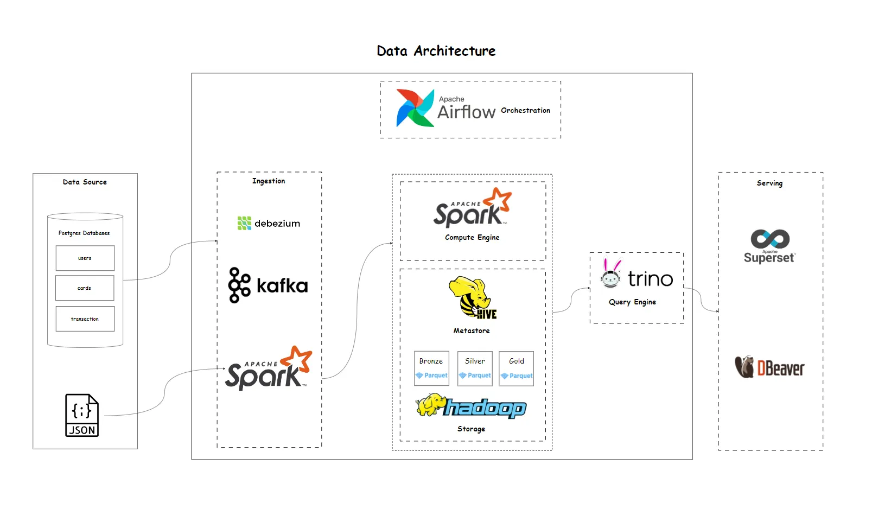

# Data Platform for Finance Transactions

## 🧭 Overview
This project implements an **on-premise data platform** built on the **Hadoop ecosystem** to perform **financial transaction analytics**.  
It follows a **Medallion Architecture (Bronze → Silver → Gold)** for data organization and integrates open-source technologies for ingestion, transformation, orchestration, and visualization.

---

## 🏗️ Data Architecture



### 🔹 Layer Overview

| Layer | Technologies | Description |
|-------|---------------|--------------|
| **Data Source** | PostgreSQL, JSON | The dataset is sourced from [Kaggle Transactions Fraud Dataset](https://www.kaggle.com/datasets/computingvictor/transactions-fraud-datasets). Data is bulk-loaded into PostgreSQL databases and simulated daily to generate new transaction records. |
| **Ingestion** | Debezium, Kafka, Spark | Debezium captures **Change Data Capture (CDC)** events from PostgreSQL (in progress). Kafka streams these CDC messages, while Spark ingests data from both databases and JSON files into the **data lake**. |
| **Data Lake** | Hadoop (HDFS), Hive, Spark, Trino | HDFS provides distributed storage; Hive stores metadata. Spark serves as the main compute engine for transformation. Trino enables unified SQL queries across the Bronze, Silver, and Gold layers. |
| **Serving & Visualization** | Trino, Apache Superset | Trino integrates with Superset to power interactive **finance analytics dashboards**. DBeaver is used for ad-hoc querying. |
| **Orchestration** | Apache Airflow | Airflow automates and schedules ingestion and transformation pipelines. |

---

## 📂 Project Structure
```
F-DATA-PLATFORM/
│
├── data/ # Local data samples or exported datasets
├── services/ # Service configurations (e.g., Docker, environment)
│
├── src/
│ ├── airflow/dags/ # Airflow DAGs for orchestration
│ │ └── dl_dag.py
│ │
│ ├── ingest/ # Batch ingestion scripts
│ │ ├── ingest.py
│ │ ├── mcc-codes.py
│ │ └── train_fraud_labels.py
│ │
│ ├── kafka/ # CDC consumers and Kafka integration
│ │ ├── cdc_cards.py
│ │ ├── cdc_transactions.py
│ │ └── cdc_users.py
│ │
│ ├── model/ # Data schema in Data Lake
│ │
│ ├── transform/ # Spark transformations and aggregation scripts
│ │ │ ├── cards.py
│ │ │ ├── market_daily_summary.py
│ │ │ ├── merchant_performance.py
│ │ │ ├── transaction_details.py
│ │ │ ├── transactions.py
│ │ │ ├── user_detail.py
│ │ │ └── users.py
│ │ └── trino_superset/
│ │ └── view.sql
│ │
│ └── utils/ # Shared helper functions and configs
│
├── .gitignore
├── image.png # Data Architecture diagram
└── README.md
```

---

## ⚙️ Data Flow

1. **Ingestion Phase**
   - Debezium streams changes from PostgreSQL tables (`users`, `cards`, `transactions`) to Kafka topics ***(In progress)***
   - Spark reads CDC streams or full table dumps and writes them into the **Bronze** layer of the Data Lake.

2. **Transformation Phase**
   - Spark processes and enriches the data from Bronze → Silver → Gold layers.
   - Scripts under `src/transform/temp` handle metrics like:
     - Market daily summary  
     - Merchant performance  
     - Transaction and user details  

3. **Storage and Metadata**
   - Data stored in **Parquet** format on HDFS.
   - Hive manages schema and partition metadata for all tables.

4. **Serving & Visualization**
   - Trino queries Hive tables across data layers.
   - Superset dashboards visualize KPIs, fraud detection patterns, and transaction trends. ***(In progress)***

5. **Orchestration**
   - Airflow DAGs coordinate ingestion and transformation pipelines on a schedule ***(In progress)***

---

## 🧠 Future Enhancements
- Add streaming transformation jobs using **Spark Structured Streaming**  
- Integrate **data quality checks**
- Using Table format like iceberg, upgrade to Data Lakehouse

---

## 📄 License
This project is released under the **MIT License**.